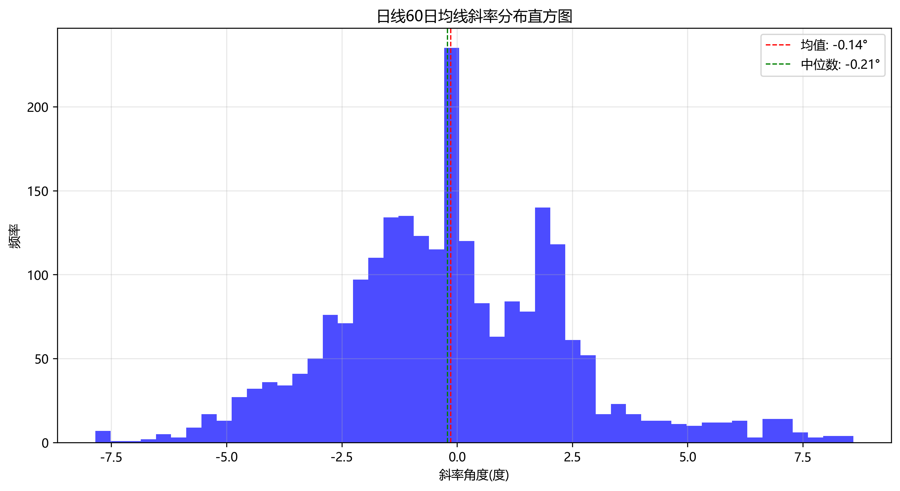
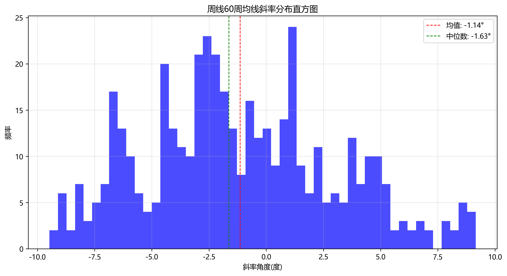

# 万科A (sz.000002) 斜率分布分析报告

## 回测时间范围
2015-10-04 至 2025-10-01

## 数据概览
- 日线数据记录数: 2431
- 周线数据记录数: 510

## 日线60日均线斜率分析
- 有效数据点数量: 2362
- 平均斜率: -0.14°
- 中位数斜率: -0.21°
- 标准差: 2.55
- 最小斜率: -7.85°
- 最大斜率: 8.60°

### 日线斜率区间分布统计
| 斜率区间 | 角度范围(度) | 数据点数量 | 占比(%) |
|---------|------------|----------|-------|
| 极陡下跌 | < --5 | 52 | 2.20% |
| 陡峭下跌 | -5 ~ -3 | 214 | 9.06% |
| 中度下跌 | -3 ~ -1 | 610 | 25.83% |
| 轻微下跌 | -1 ~ 0 | 415 | 17.57% |
| 零斜率 | = 0 | 62 | 2.62% |
| 轻微上涨 | 0 ~ 1 | 340 | 14.39% |
| 中度上涨 | 1 ~ 3 | 541 | 22.90% |
| 陡峭上涨 | 3 ~ 5 | 96 | 4.06% |
| 极陡上涨 | > 5 | 94 | 3.98% |

## 周线60周均线斜率分析
- 有效数据点数量: 446
- 平均斜率: -1.14°
- 中位数斜率: -1.63°
- 标准差: 4.14
- 最小斜率: -9.47°
- 最大斜率: 9.15°

### 周线斜率区间分布统计
| 斜率区间 | 角度范围(度) | 数据点数量 | 占比(%) |
|---------|------------|----------|-------|
| 极陡下跌 | < --5 | 82 | 18.39% |
| 陡峭下跌 | -5 ~ -3 | 69 | 15.47% |
| 中度下跌 | -3 ~ -1 | 89 | 19.96% |
| 轻微下跌 | -1 ~ 0 | 38 | 8.52% |
| 零斜率 | = 0 | 0 | 0.00% |
| 轻微上涨 | 0 ~ 1 | 37 | 8.30% |
| 中度上涨 | 1 ~ 3 | 50 | 11.21% |
| 陡峭上涨 | 3 ~ 5 | 48 | 10.76% |
| 极陡上涨 | > 5 | 33 | 7.40% |

## 斜率分布对比分析
- 日线平均斜率比周线高: 1.00°
- 日线斜率波动比周线小: 1.60

## 周线与日线组合场景分析
根据斜率分布，我们可以将市场状态分为9种组合场景：

### 各组合场景定义及时间占比统计
| 周线场景 | 日线场景 | 组合场景名称 | 市场特征 | 天数 | 占比(%) |
|---------|---------|------------|---------|-----|-------|
| 周线多头 | 日线多头 | 多头太阳 | 强烈上涨趋势，双周期共振向上 | 287 | 12.15% |
| 周线多头 | 日线震荡 | 多头少阳 | 周线趋势向上，日线整理 | 157 | 6.65% |
| 周线多头 | 日线空头 | 多头少阴 | 周线趋势向上，日线短期回调 | 179 | 7.58% |
| 周线震荡 | 日线多头 | 震荡小阳 | 周线整理，日线短期上涨 | 267 | 11.30% |
| 周线震荡 | 日线震荡 | 震荡平衡 | 双周期均处于整理状态 | 186 | 7.87% |
| 周线震荡 | 日线空头 | 震荡小阴 | 周线整理，日线短期下跌 | 147 | 6.22% |
| 周线空头 | 日线多头 | 空头小阳 | 周线趋势向下，日线短期反弹 | 177 | 7.49% |
| 周线空头 | 日线震荡 | 空头少阴 | 周线趋势向下，日线整理 | 412 | 17.44% |
| 周线空头 | 日线空头 | 空头太阴 | 强烈下跌趋势，双周期共振向下 | 550 | 23.29% |

### 日线各场景占比
| 场景 | 斜率区间 | 数据点数量 | 占比(%) |
|-----|---------|----------|-------|
| 日线空头 | < -1 | 876 | 37.09% |
| 日线震荡 | -1 ~ 1 | 817 | 34.59% |
| 日线多头 | > 1 | 669 | 28.32% |

### 周线各场景占比
| 场景 | 斜率区间 | 数据点数量 | 占比(%) |
|-----|---------|----------|-------|
| 周线空头 | < -1 | 240 | 53.81% |
| 周线震荡 | -1 ~ 1 | 75 | 16.82% |
| 周线多头 | > 1 | 131 | 29.37% |

### 当前市场组合场景
基于最近10年数据的平均斜率分析，当前市场整体处于：**空头少阴** 状态。
- 日线平均斜率: -0.14°，属于震荡市场
- 周线平均斜率: -1.14°，属于空头市场

### 组合场景特征分析
- **最常见场景**: 空头太阴，占比 23.29%
- **多头相关场景总占比**: 26.38%
- **空头相关场景总占比**: 48.22%
- **震荡相关场景总占比**: 25.39%

## 基于斜率分布的投资建议
- **总体判断**: 震荡市场 - 日线和周线的斜率分布较为均衡，市场可能处于震荡整理阶段。

### 震荡市斜率空间建议
- **识别特征**: 日线斜率在-1°至1°区间占比约34.58%（轻微下跌17.57%+轻微上涨14.39%+零斜率2.62%），周线斜率在-1°至1°区间占比约16.82%，市场处于震荡整理阶段。
- **操作建议**: 震荡市可关注斜率在-1°至1°之间的交易机会，适合采用区间交易策略，在斜率接近-1°时考虑低吸，接近1°时考虑高抛。

### 多头市场斜率空间建议
- **识别特征**: 日线斜率在1°以上占比约30.94%（中度上涨22.90%+陡峭上涨4.06%+极陡上涨3.98%），周线斜率在1°以上占比约29.37%（中度上涨11.21%+陡峭上涨10.76%+极陡上涨7.40%）。
- **操作建议**: 多头市场可关注斜率在1°至3°（中度上涨区间）的持仓机会，此区间占比最高，趋势相对稳定；当斜率超过3°时（陡峭/极陡上涨），需警惕短期过热风险。

### 空头市场斜率空间建议
- **识别特征**: 日线斜率在-1°以下占比约37.09%（中度下跌25.83%+陡峭下跌9.06%+极陡下跌2.20%），周线斜率在-1°以下占比约53.82%（中度下跌19.96%+陡峭下跌15.47%+极陡下跌18.39%）。
- **操作建议**: 空头市场中，斜率在-3°至-1°（中度下跌区间）占比最高，可作为主要观察区间；当斜率低于-3°时（陡峭/极陡下跌），可能接近超跌区域，注意把握反弹机会。
- **把握反弹机会**: 当市场处于超跌状态（斜率低于-3°）后，可重点关注以下信号：
  1. 斜率从极端负值开始回升（从<-3°回升至>-3°但仍为负），表明下跌动能开始减弱
  2. **日线斜率靠近0°至1°区间**，是重要的反弹信号，说明短期趋势可能从下跌转为走平或小幅上涨
  3. 结合组合场景分析，若周线仍处于空头但日线出现"空头小阳"（周线空头+日线多头）或"空头少阴"（周线空头+日线震荡），可考虑轻仓参与反弹
  4. 反弹操作建议采用小仓位试探策略，设置严格止损，因为整体趋势仍处于空头市场